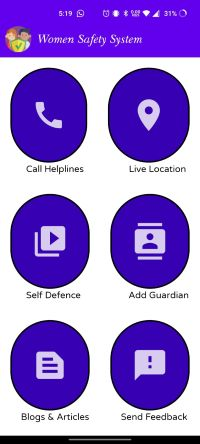
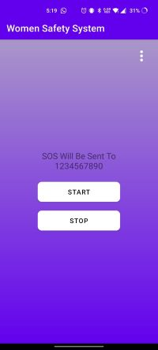
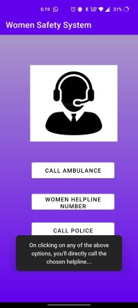

# Women Safety App
Safety of women has become a major issue as the number of crimes over women and girls keep increasing day-by-day. This application is designed to provide safety to women.

## Main idea
The main idea of this application is to provide help immediately to any women who is in danger. This is basically an Android Based application. The proposal is to have following features the app:
- **Send SOS messages**: The app will send a SOS message stating that the person is in need of help with their current _location details_ to their saved contact on shaking the mobile device given the user has started the service.
- **Make SOS Calls**: Make calls to the saved numbers when in need of help just on a click of a button so that help can be provided immediately.
- **Call Helplines**: Call specific helplines such as ambulance, police stations or women helplines by just clicking a button.
- **Read related Articles**: Users will be able to read related articles such as self-defense techniques, etc. in the "Blogs & Articles" section 
- **Nearest Police Station**: The app will show the location of nearest police station and will also make SOS calls and send text messages to the nearest police station.
- **Hospital Support**: The app will find out the nearest hospital and will inform them to send an ambulance for the victim.
- **Gesture Support**: If a girl shakes her phone, this should execute the SOS call and message feature.

Splash Screen            |  Main Activity with all features   | SOS Activity            |  Call Helplines Activity
:-------------------------:|:-------------------------:|:-------------------------:|:-------------------------:
  |    |    |  

## Software Requirements

- Operating System for app to work: **Android**
- Programming Languages Used: **Java**
- **XML** is used for front end
- **Firebase Realtime Database** is used to store user-inputs.
- This project is made using **Android Studio IDE**

## Implementation Details
#### Currently Implemented:
- The app asks the user to Add Guardian to whom they would like to inform in need of help. There are features to start and stop shake service as per user's need and also a change number functionality.
- On shaking the mobile device after starting the service in the app, an siren sound starts playing and a text message containing the victims current location is sent to the number provided by the user.
- The current location is accessed using the latitude and longitude of the location.
- The user can also make calls to police, ambulance and women helpline numbers whenever in danger.

#### Future implementation:
- Further, a feature to find the safe paths to destination will be developed. This can be made by integrating Google Maps in the app. It will suggest the paths which are short and more crowded. This can be done by implementing map as a graph, locations as nodes, streets as edges and crowd as weight of edges. 
- Through Google maps we can also find the nearest Police station and hospitals and alert them by sending them a message similarly as above.
- Next we will make this app work fine even with voice commands by implementing voice recognition models.
- Multiple guardians support can be added.
- Fake call feature can be added

## Conclusion and Future Scope:
- With the above mentioned features, a better safety for the women in society will be ensured.
- This app will be reliable, secure and robust because it is developed using Java.
- Everyone owns an Android mobile phone, hence it will easy to use and very cost effective.
- Further, if needed this can be implemented into a web based application too which will make it cross-platform and can be made to run on Android, Windows & MacOS.
-------

